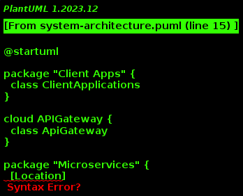

# Architecture Decisions Document

## Date: [Date]

## Context

Our system involves the development of a distributed application with multiple services, each serving a specific purpose. The primary components include a frontend (fe) that serves as a REST API, a `connection` service that retrieves data from a `person-rpc` service using gRPC, and a mechanism for creating `person` and `location` entities using a Kafka topic.

## Decision 1: Frontend as REST API

### Considerations

- REST APIs are widely adopted and well-suited for exposing services over HTTP.
- Simplicity and ease of integration with various clients.

### Decision

The frontend (`fe`) will be designed as a REST API. This decision is based on the familiarity of RESTful principles and the ease with which clients can interact with the system using standard HTTP methods.

## Decision 2: gRPC for `connection` to `person-rpc`

### Considerations

- `connection` needs to retrieve data from `person-rpc`.
- gRPC provides a high-performance, language-agnostic RPC framework.

### Decision

`connection` will communicate with `person-rpc` using gRPC. This decision is motivated by the efficiency and ease of use offered by gRPC, enabling strongly-typed communication and efficient serialization.

## Decision 3: Kafka Topic for Creating `person` and `location`

### Considerations

- Asynchronous communication for creating entities.
- Kafka provides a distributed, fault-tolerant, and scalable message broker.
